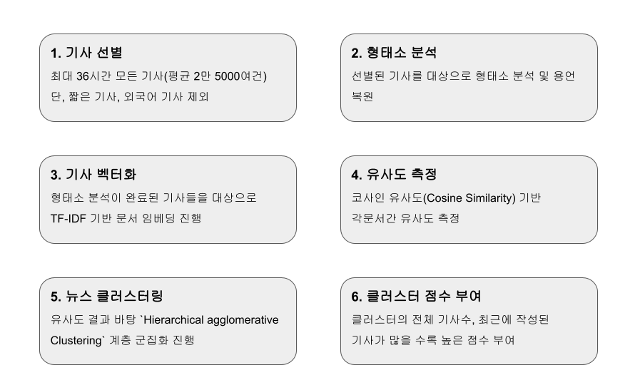
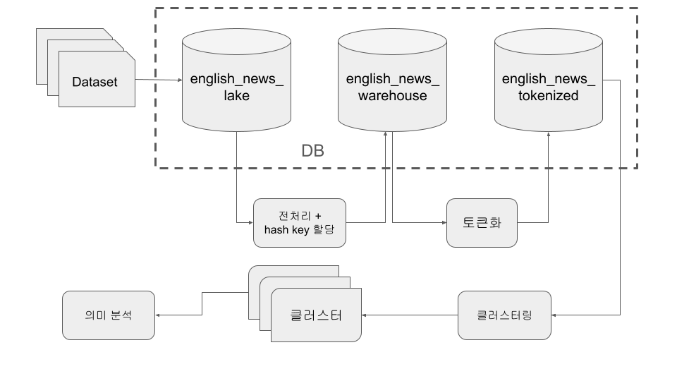
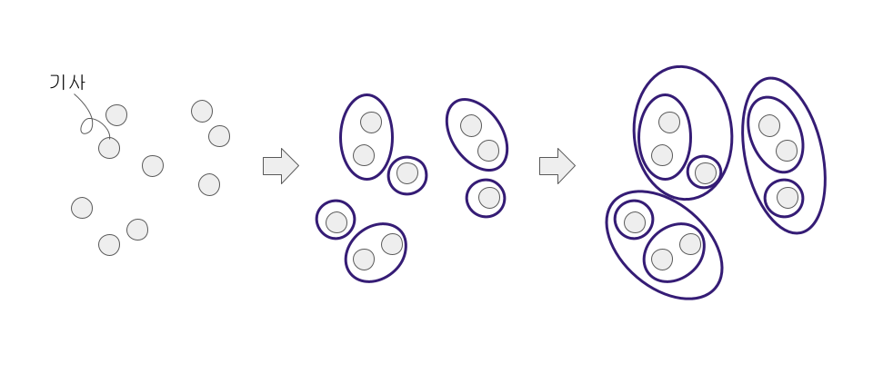
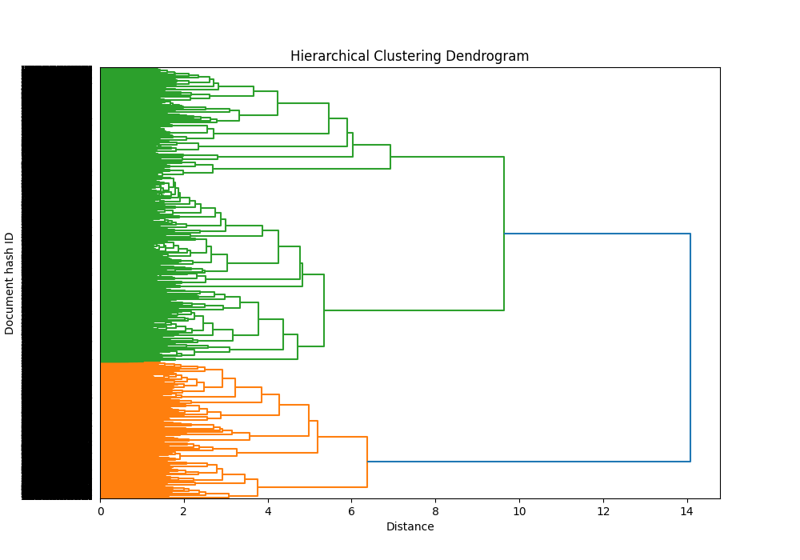
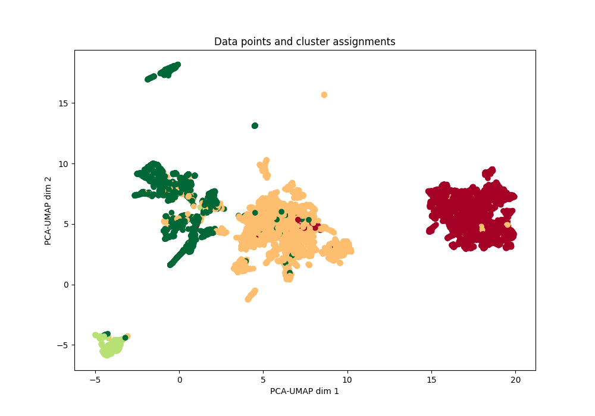

## Kaggle 영어 뉴스기사 데이터 기반 뉴스 클러스터링

- 참여자:
  - [유정연](https://github.com/yjyj989812)
  - [노석현](https://github.com/shtjrgus010)
  - [이서연](https://github.com/bonabanq)
  - [조명아](https://github.com/linaauddk)
  - [최성현](https://github.com/S0rrow)
  - [추현영](https://github.com/CHUrururu)

---
## 1. Back-Ground
- 국내 최대 온라인 뉴스 서비스를 제공하는 `네이버`는 2019년도 부터 AI 알고리즘을 도입하여, 사용자에게 효율적인 기사 추천 및 뉴스 주제를 제공 중입니다.
- 네이버 뉴스 AI 알고리즘은 크게 개인화 추천을 당담하는 `AiRS(AI Recommender System)`와 뉴스 군집화를 당담하는 `뉴스 클러스터링(News Clustering)`으로 나눠저 있습니다.
- 이번 프로젝트에서는 네이버 뉴스의 뉴스 클러스터링 알고리즘을 역공학, 이를 Kaggle 영어 기사 Dataset에 적용하여 나온 클러스터들에 대한 의미 분석을 진행하고자 합니다.

---
## 2. Goals
> 1. 네이버 뉴스 클러스터링 알고리즘 분석
> 2. 뉴스 기사 클러스터링 문제 정의
> 3. 알고리즘 분석 기반 시스템 구조 설계 및 방법론 선택
> 4. 클러스터링에 필요한 모델 구축
> 5. 각 클러스터에 대한 Topic modeling 및 의미분석

---
## 3. 네이버 뉴스 클러스터링 알고리즘

---
## 4. 문제 정의

알고리즘 분석 후 정의한 문제들은 다음과 같습니다.

  | - | 문제 | 확정안 |
  |:---|:---|:---|
  | 1 | 대상 언어 | 영어 |
  | 2 | 사용할 Dataset | Kaggle 영어 뉴스 기사 |
  | 3 | 기사 임배딩 방법론 | TF-IDF |
  | 4 | 기사간 유사도 측정 방법론 | 코사인 유사도 |
  | 5 | 각 클러스터링 의미 분석 방법론 | LDA, TF-IDF |

---
## 5. 프로젝트 진행 구조

---
## 6-1. Data 수집

1. 목적: 1차 데이터 집합소
2. data 갯수: 6만여건
3. english_news_lake Table에 저장됨

  | - | dataSource | title | context |
  |:---:|:---:|:---:|:---:|
  | 1 | BBC | Rank 'set to sell off film unit' |  Leisure group Rank could... |
  | 2 | CNN | 'The Gilded Age' reminds us that the Black... |  (CNN)The storyline of "The Gilded Age"... |
  | 3 | spaceNews | SES Q&A Leveling up multi-orbit connectivity | Multi-orbit satellite operator... |

---
## 6-2. 전처리

1. 목적: 정확한 의미를 가진 단어 추출

  | - | 단계 | 예시 |
  |:---:|:---:|:---:|
  | 0 | 데이터 선택 | \tThe US Bank loses 1.3M $, almost 2%\n. |
  | 1 | 소문자화 | \tthe us bank loses 1.3m $, almost 2%\n. |
  | 2 | % 기호 변환 | \tthe us bank loses 1.3m $, almost 2percent\n. |
  | 3 | 통화 변환 | \tthe us bank loses 1.3m dollar, almost 2percent\n. |
  | 4 | escape 문자 제거 | the us bank loses 1.3m dollar, almost 2percent. |
  | 5 | 숫자, 영어 띄우기 | the us bank loses 1.3 m dollar, almost 2 percent. |
  | 6 | 숫자를 단어로 변환 | the us bank loses one point three m dollar, almost two percent. |
  | 7 | 특수기호 제거 | the us bank loses one point three m dollar almost two percent |

---
## 6-3. hash key 부여

1. 전처리 후 title + context를 기반으로 hash key 생성, 문서 조회 및 중복 제거에 사용
2. Google의 cityhash 사용
3. english_news_warehouse Table에 저장됨

  | - | dataSource | title | context | docKey |
  |:---:|:---:|:---:|:---:|:---:|
  | 1 | BBC | rank set to sell off film unit | leisure group rank could... | 10023453206476767394 |
  | 2 | CNN | the gilded age reminds us that the black... | cnn The storyline of the gilded age... | 2913924185103151115 |
  | 3 | spaceNews | ses q a Leveling up multi orbit connectivity | multi orbit satellite operator... | 13118855393879759351 |

---
## 6-4. 토큰화(Tokenization)

1. warehouse의 title과 context를 합친 후 token을 생성
2. 이때 nltk의 word_tokenizer를 사용하여 토큰화 진행
3. 생성된 토큰에서 불용어(stop word)과 길이가 1 이하인 토큰 제거
4. 이렇게 생성된 토큰들은 english_news_tokenized Table에 저장되며, TF-IDF 계산 및 클러스터링에 사용됨

  | - | docKey | tokens |
  |:---:|:---:|:---:|
  | 1 | 10023453206476767394 | rank set to sell off film unit leisure group rank could ... |
  | 2 | 2913924185103151115 | the gilded age reminds us that the black  cnn The storyline of the gilded age ... |
  | 3 | 13118855393879759351 | ses Leveling up multi orbit connectivity multi orbit satellite operator ... |

---
## 7. 계층적 군집화(Hierarchical agglomerative Clustering)

- IT-IDF로 임배딩 및 각 문서간 코사인 유사도 계산을 진행한 후, 계층적 군집화를 실시
- 문서간의 클러스터링 분리 기준은 각 문서간의 거리에 의해 정해짐
- 컴퓨터의 성능 한계로 인해 기존 전체 기사에 대한 클러스터링 대신 1만건의 기사를 랜덤 추출하여 클러스터링 진행

  | 클러스터 번호 | 클러스터 내 기사 갯수 |
  |:---:|:---:|
  | 1 | 3170 |
  | 2 | 4291 |
  | 3 | 300 |
  | 4 | 2159  |

---
## 7. 계층적 군집화(Hierarchical agglomerative Clustering)

---

---

---
## 8-1. 클러스터 별 의미 분석 - 클러스터 1

- 클러스터 내 기사 갯수: 3,170
- TF-IDF 기준 상위 10개 단어

  | 단어 | TF-IDF 점수 |
  |:---:|---:|
  | "chilean" | 179.746116568098 |
  | "fiducials" | 169.29834310808923 |
  | "flightpath" | 163.68076378014234 | 
  | "startrak" | 127.32613046573834 |
  | "complexes" | 126.80006440860556 | 
  | "pgs" | 116.6877290672868 |
  | "associat" | 105.97645272773238 | 
  | "radiometers" | 103.49777812473424 |
  | "cfowashington" | 94.15924455608123 | 
  | "financials" | 85.66876718280221 |

---
## 8-1. 클러스터 별 의미 분석 - 클러스터 1

- 클러스터 내 기사 갯수: 3,170
- LDA 결과 기준 상위 주요 주제 10순위

  | 주제 | 토픽 연관 단어 |
  |:---:|:---:|
  | Topic 1 | ["skywatch", 1.5], ["newsat", 1.21], ["agintegrated", 0.9], ["apogeo", 0.7], ["seds", 0.69], ["jabiru", 0.62] |
  | Topic 2 | ["space", 179.83], ["said", 169.28], ["two", 163.66], ["launch", 127.96], ["nasa", 126.84], ["satellite", 116.85] |
  | Topic 3 | ["photoshoot", 0.56], ["upton", 0.45], ["supermodel", 0.33], ["swimsuit", 0.33], ["parabolas", 0.1], ["dumbacher", 0.1] |
  | Topic 4 | ["robonaut", 0.68], ["radioed", 0.14], ["laugh", 0.14], ["mon", 0.13], ["unpacked", 0.12], ["terrains", 0.11] |
  | Topic 5 | ["yahlive", 0.67], ["usns", 0.58], ["farsi", 0.49], ["hospital", 0.44], ["mercy", 0.44], ["boustany", 0.31] |
  | Topic 6 | ["mda", 0.1], ["viasat", 0.1], ["omnispace", 0.1], ["satellite", 0.1], ["copernicus", 0.1], ["fiveg", 0.1] |

---
## 8-2. 클러스터 별 의미 분석 - 클러스터 2

- 클러스터 내 기사 갯수: 4,291
- TF-IDF 기준 상위 10개 단어

  | 단어 | TF-IDF 점수 |
  |:---:|---:|
  | "nonaligned" | 167.08783181681235 |
  | "andros" | 141.15889656986297 |
  | "cambridgethis" | 126.60981203667717 |
  | "shamsuddin" | 109.84013615958887 |
  | "kidal" | 89.63192912584017 |
  | "keys" | 84.12400696151346 |
  | "cuz" | 83.63576287596122 |
  | "esophageal" | 81.46621991378737 |
  | "redressable" | 79.06555464249361 |
  | "rubbish" | 74.25930919132541 |

---
## 8-2. 클러스터 별 의미 분석 - 클러스터 2

- 클러스터 내 기사 갯수: 4,291
- LDA 결과 기준 상위 주요 주제 10순위

  | 주제 | 토픽 연관 단어 |
  |:---:|:---:|
  | Topic 1 | ["pun", 1.17], ["chong", 1.09], ["aymara", 0.11], ["olreplaymore", 0.11], ["sixteenmany", 0.1], ["traversing", 0.1] |
  | Topic 2 | ["chikli", 0.58], ["paillard", 0.1], ["brexit", 0.1], ["kirac", 0.1], ["bobille", 0.1], ["letterheads", 0.1] |
  | Topic 3 | ["broadband", 0.1], ["papadopoulos", 0.1], ["seselj", 0.1], ["lava", 0.1], ["mueller", 0.1], ["russia", 0.1] |
  | Topic 4 | ["tata", 0.91], ["hulot", 0.83], ["sayeed", 0.81], ["cairn", 0.76], ["marbella", 0.64], ["laureus", 0.41] |
  | Topic 5 | ["wombat", 0.79], ["dink", 0.78], ["notte", 0.75], ["falco", 0.73], ["wombats", 0.67], ["redlands", 0.63] |
  | Topic 6 | ["savannah", 0.1], ["projectile", 0.1], ["malawi", 0.1], ["women", 0.1], ["biden", 0.1], ["obama", 0.1] |

---
## 8-3. 클러스터 별 의미 분석 - 클러스터 3

- 클러스터 내 기사 갯수: 300
- TF-IDF 기준 상위 10개 단어

  | 단어 | TF-IDF 점수 |
  |:---:|---:|
  | "coursesreplaymore" | 126.53919099951534 |
  | "fhnfivetjnjksix" | 97.1306900773506 |
  | "pragmatism" | 88.24374498022507 |
  | "dusted" | 67.68140374763419 |
  | "conclude" | 61.62307879368275 |
  | "mctominay" | 58.550693553688205 |
  | "rajab" | 57.982354856230124 |
  | "virtuoso" | 51.81463452119901 |
  | "twohzdtwo" | 49.786778593574454 | 
  | "watchednba" | 49.53333476480752 |

---
## 8-3. 클러스터 별 의미 분석 - 클러스터 3

- 클러스터 내 기사 갯수: 300
- LDA 결과 기준 상위 주요 주제 10순위

  | 주제 | 토픽 연관 단어 |
  |:---:|:---:|
  | Topic 1 | ["messi", 0.1], ["fury", 0.1], ["club", 0.1], ["barcelona", 0.1], ["two", 0.1], ["saudi", 0.1] |
  | Topic 2 | ["two", 126.56], ["one", 97.28], ["thousand", 88.26], ["photos", 67.73], ["caption", 61.67], ["hide", 58.6] |
  | Topic 3 | ["fone", 0.1], ["thousand", 0.1], ["two", 0.1], ["strasburg", 0.1], ["dominici", 0.1], ["pel", 0.1] |
  | Topic 4 | ["terry", 0.1], ["akinfenwa", 0.1], ["two", 0.1], ["australian", 0.1], ["buemi", 0.1], ["telfer", 0.1] |
  | Topic 5 | ["parsons", 0.1], ["falivena", 0.1], ["athletes", 0.1], ["morton", 0.1], ["ipc", 0.1], ["paralympic", 0.1] |
  | Topic 6 | ["harriers", 0.73], ["sculls", 0.45], ["australiamen", 0.36], ["belgrave", 0.31], ["statesmen", 0.28], ["skatingread", 0.27] |

---
## 8-4. 클러스터 별 의미 분석 - 클러스터 4

- 클러스터 내 기사 갯수: 2,159
- TF-IDF 기준 상위 10개 단어

  | 단어 | TF-IDF 점수 |
  |:---:|---:|
  | "cadantu" | 35.242253042629805 |
  | "cetovska" | 33.53153990006173 |
  | "sixthis" | 27.05753748219055 |
  | "aborigine" | 21.445828500995404 |
  | "thirteenhalep" | 19.163760421416598 |
  | "lengthening" | 18.83566978722424 |
  | "openwilliams" | 18.4472589999831 |
  | "sarcastic" | 17.527359170725077 |
  | "fears" | 15.872690022844587 |
  | "pliskovapliskova" | 15.36905945414498 |

---
## 8-4. 클러스터 별 의미 분석 - 클러스터 4

- 클러스터 내 기사 갯수: 2,159
- LDA 결과 기준 상위 주요 주제 10순위

  | 주제 | 토픽 연관 단어 |
  |:---:|:---:|
  | Topic 1 | ["priced", 0.13], ["silverware", 0.13], ["careerthe", 0.13], ["adds", 0.13], ["stuns", 0.13], ["exemplary", 0.13] |
  | Topic 2 | ["six", 0.13], ["three", 0.13], ["federer", 0.13], ["gauff", 0.13], ["goodthe", 0.13], ["baby", 0.13] |
  | Topic 3 | ["six", 34.48], ["two", 32.86], ["one", 26.54], ["open", 21.03], ["three", 18.79], ["thousand", 18.53] | 
  | Topic 4 | ["six", 0.17], ["two", 0.15], ["one", 0.15], ["three", 0.15], ["four", 0.14], ["seven", 0.14] |
  | Topic 5 | ["photos", 0.14], ["six", 0.14], ["caption", 0.14], ["williams", 0.13], ["open", 0.13], ["hide", 0.13] |
  | Topic 6 | ["photos", 0.14], ["hide", 0.13], ["two", 0.13], ["caption", 0.13], ["wawrinka", 0.13], ["six", 0.13] |

---
## 8. 결론

- TF-IDF 및 클러스터링을 통해 유사 주제를 가진 기사끼리 분류 가능성 시사
- 클러스터링 기준이 일반적인 뉴스 주제가 아닌 특정 이슈나 이밴트를 기준으로 군집이 생성되는 것으로 보임.
- 현재 다음 문제 존재
  - 물리적 한계: 컴퓨터 성능으로 인한 기사 1만건에 대한 클러스터링이 불가능 
  - 성능적 한계: 기사 1만건 이상 부터는 클러스터링 결과가 좋치 못하며, 잘 못된 전처리로 인해 의미 없는 단어들이 성능에 영향을 줌
  - 의미 해석의 한계: 각 클러스터링에 대한 주제어나 주요 주제를 추출하였지만, 실제로 이 결과가 유의미한지 미검증

---
## 9. 후속 계획

> 1. 문서 수집 및 모델 작동 배치 자동화
> 2. 모델 등 시스템 최적화
> 3. 추출한 주제 및 주제어에서 의미 있는 단어 자동 추출
> 4. 토큰화 작업 성능 개선